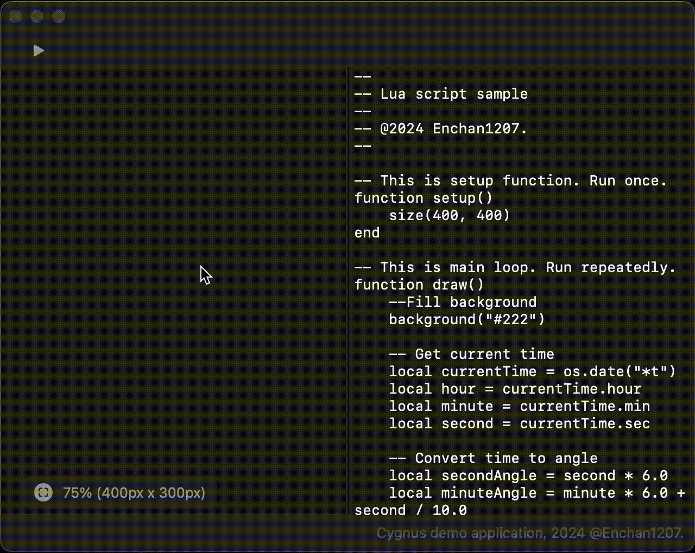

# Cygnus-demo-macOS

Welcome to Cygnus demo app branch!  
This branch is detached from Cygnus package and provides sample application for macOS.

## Overview

The application *Asteroid* is provided for macOS. This is Lua graphical programming environment.



## Installation

First, clone this branch:

```sh
git clone -b demo-macOS https://github.com/Enchan1207/Cygnus
```

Then open `Cygnus-demo-macOS.xcodeproj` and build it.

## License

This demo application is published under [MIT License](LICENSE).
